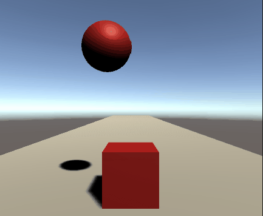
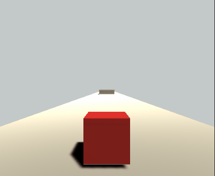

# Brackys Beginner tutorial

1. press alt+click for rotation
1. press hand icon on top left for drag
1. the button on th top right can bring the default view if you change something.
1. press F to focus on an object

1. You can add material to object by right clicking on asset pane and ading material, then you simpley have to drag and drop onto the object in the scene to apply
1. QWERT for quick switch between rotation and transformation
1. ctrl +D for duplicate
1. Add rigid body component to standard object



1. shift+space to maximize the game view.
1. scripts are added just how we add components
1. `Debug.Log("")` for logging

1. public Rigidbody rb;
    // rb is set to Player through ui

1. //rb.AddForce(0,0,2000 * Time.deltaTime);
        // Time.deltaTime added to even it across framerates

1. // unity likes it if we used Fixed Update instead of Update
    void FixedUpdate(){
        rb.AddForce(0,0,2000 * Time.deltaTime);
    }

1. Friction can be minimised by adding physics material from asset tab. Select friction a s0 and apply it on ground.

1. if you want to make camera follow prayer movement you can simply drag it inside player,  however this will follow the player entirely.

the problem,  weird collsions: 


1. next way is to make a script to make camera follow player position.
1. camera offset chosen 0,1,-5, for following the player.

Look at collision video once more so as to add box collision

```

using UnityEngine;


public class PlayerCollision : MonoBehaviour
{

    public PlayerMovement movement;
   // called whenever objet collides with something
   void OnCollisionEnter(Collision collisionInfo){
       if(collisionInfo.collider.tag == "Obstacle"){
           Debug.Log("We hit an Obstacle !");
       }
       
   }
}

```
1. `OnCollisionEnter` function loads whenever object collides with something

1. A Vector3 stores 3 floats.

https://www.youtube.com/watch?v=gAB64vfbrhI&list=PLPV2KyIb3jR53Jce9hP7G5xC4O9AgnOuL&index=6&pbjreload=101

5.34

resolve why pressing d and a is not working.

1. Press 'F' to focus on it

