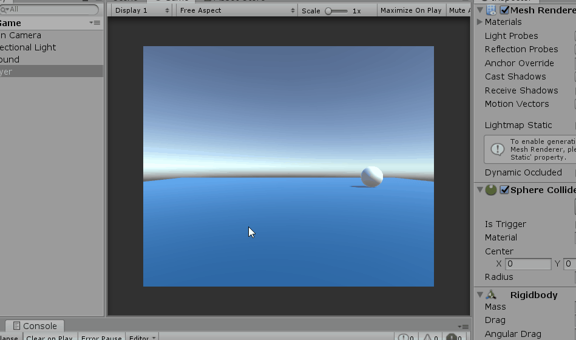
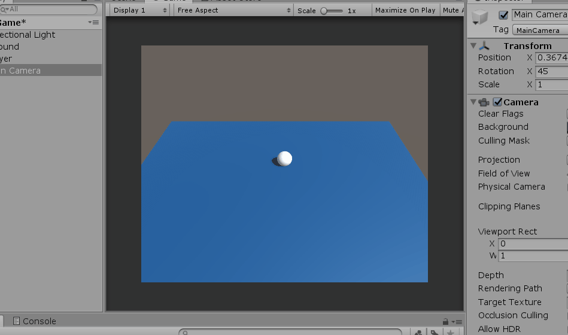
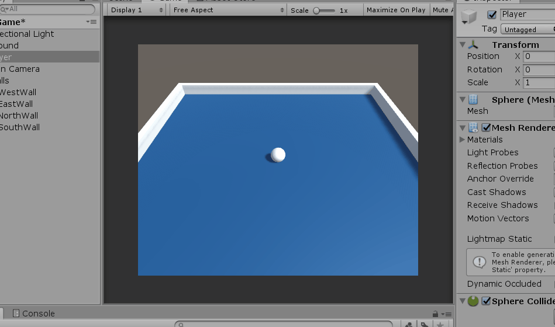
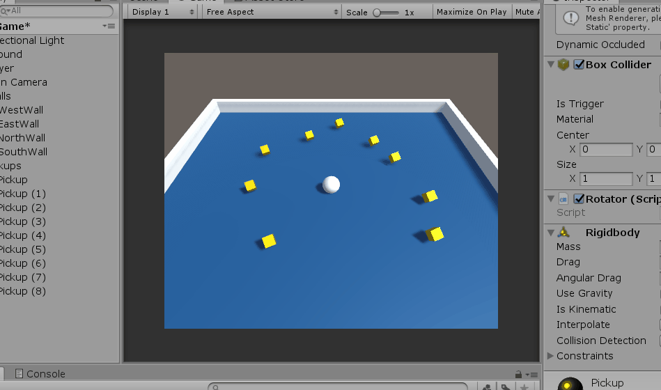

# Unity journey

Other tutorials that I followed are given in folders.

1. Roll a ball
2. Brackeys basics

## Roll a ball tutorial - from Unity

a. How to add a new object from heirarchy and add a color.

b. add a script as a component, to control movement of ball

c. add a script so that camera moves with the ball using offset without making it the child

d. walls created and empty object can be usedto organise gameobjects as well

e. colliding pyhsics with pickup object and tags using pickup as a prefab

f. In build settings build created for windows.